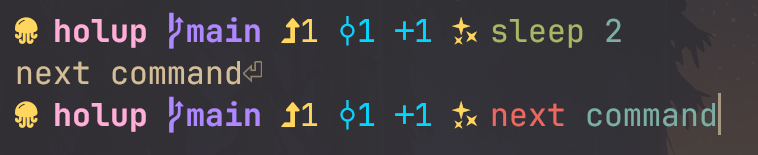
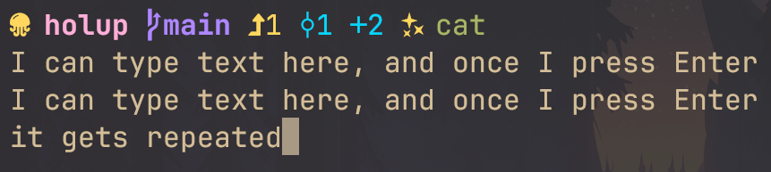
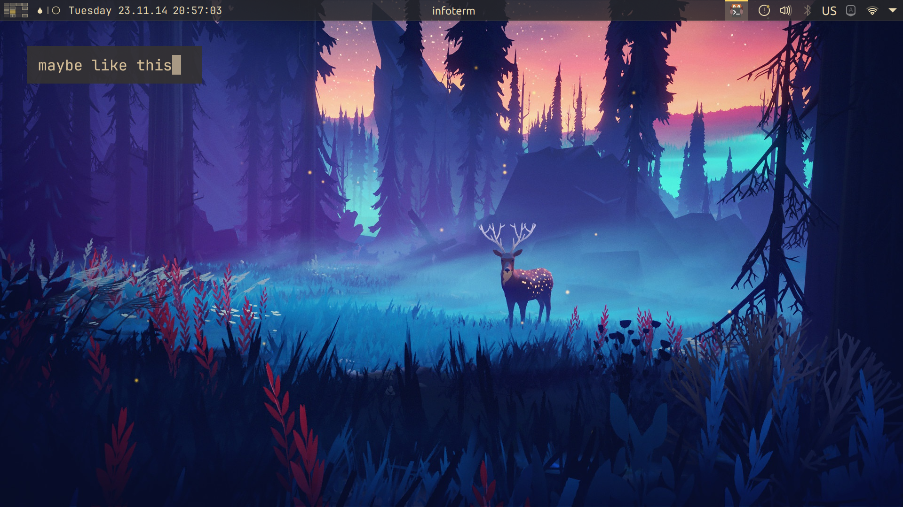
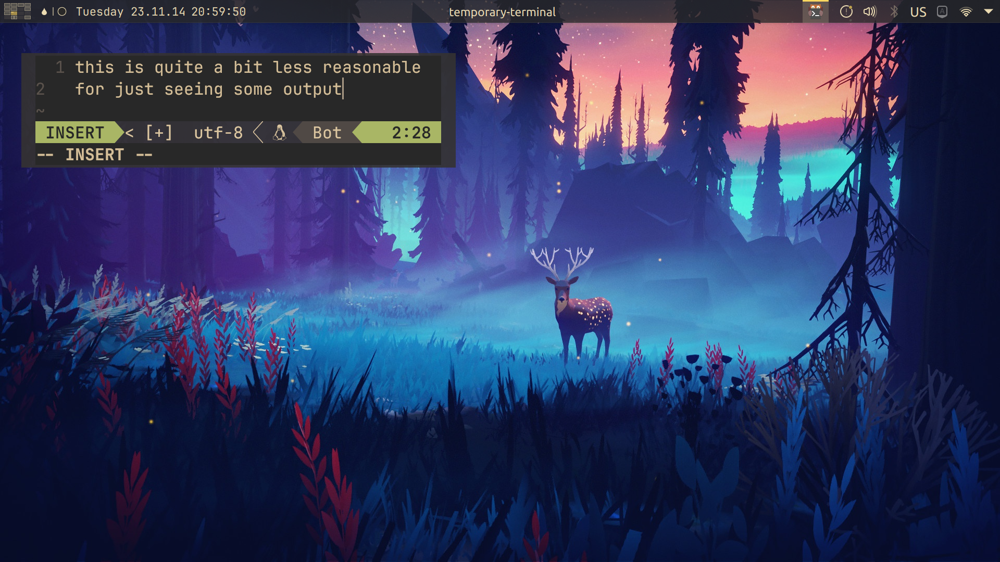

# Holup

...And that's all this program does.

Yes, it literally just "holds up" your thread by infinitely sleeping.

I would be massively surprised if you were actually looking for this, but let me elaborate about why I decided to create this to begin with.

Have you ever executed some command and started typing in the next command immediately, not recognizing that the 1st command hasn't finished yet?

You get into the same type of state if you execute a command that's expecting stdin, but you aren't piping anything into the command

While you're in this (what I call) "stdin state", you can just type things out normally. Even something like ctrl+w to delete a word and ctrl+u to delete up until the start of the line work, making typing there actually somewhat reasonable.

For all I know, the other shell emacs-like hotkeys (such as for moving by words) may work, but I'm a vim user so I don't know them.

This seems like a cool state that combines both seeing the text you input and giving you a reasonable ability to input it.

What if we remove the shell prompt?

Aha! This shows more specifically that it's a state that combines *input* and *output*. I wonder how we can make this useful

Wait... So if we make a hotkey that launches any program that does **literally nothing** and holds up the thread, we now have a convenient way to both input text, and see it on our screen.

And **that's** why this "infinite loop program" exists.

Say you have some information on your screen that you need to keep somehow, but you know said information will disappear soon enough for some reason.

Maybe you have info in one tab, and want to cross reference it in another tab / window / virtual desktop.
Tiling tabs / windows would often be an overreaction for this type of task, especially if it's just some bits and pieces of information, that may even be in different places!

If you wanna see this "feature" in action, I use it extensively in the latter half of this stream I did: https://youtube.com/live/PY7KAG3Qdb4